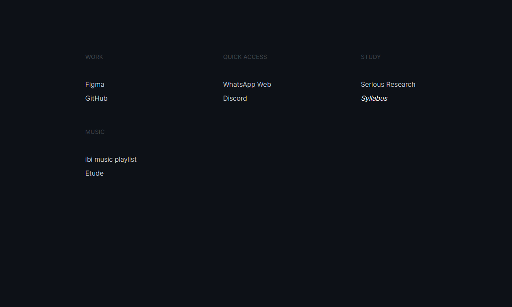

# SimpleTab v2



Simple Tab is a simple new tab replacement for browsers.

## Adding and formatting links

Click on Edit Links to add/update links.

The following is used for the demo.

```
> Work
Figma(https://www.figma.com/)
GitHub(https://github.com/mohanvpatta)
> Music
ibi music playlist(https://www.youtube.com/watch?v=0KPJE-NiwWs&list=PLqKA3N8MEtw8WG1QkJ8VAT-Pl-4NdNCEO)
Etude(https://www.youtube.com/watch?v=4VR-6AS0-l4&list=PLqKA3N8MEtw8KxxV2CvMILBQ1E4CmbepJ)
---
> Quick Access
WhatsApp Web(https://web.whatsapp.com/)
Discord(https://discord.com/app)
---
> Study
Serious Research(https://broken-idioms.com/)
Syllabus(https://twitter.com/Thereisnocat_)
```

1. Use `>` followed by your group name to seperate links into groups.
2. Use `---` to seperate links into sections. A section is created by default.
3. Use the format `link-name(link-url)` to format your links. 1 per each line.

## Editing the colors

The extension uses css variables to assign colors to the elements. I will try to handle theme changes better in the next version.

To change the defaults click on Edit Colors.

These are the defaults:

```
--primary-links-color: #c9d1d9;
--secondary-links-color: #3e4248;
--highlight-color: #12b5cb;
--config-color: #000000;

--links-background-color: #0d1117;
--config-background-color: #ffffff;

--border-color: #30363d;

--button-text-color: #c9d1d9;
--button-border-color: #30363d;
--button-hover-border-color: #8b949e;
--button-background-color: #21262d;
--button-hover-background-color: #30363d;
```

To change the colors, replace the hexcode of the variable. For example the following changes the backgorund color to red,

```
--config-background-color: #ff0000;
```
